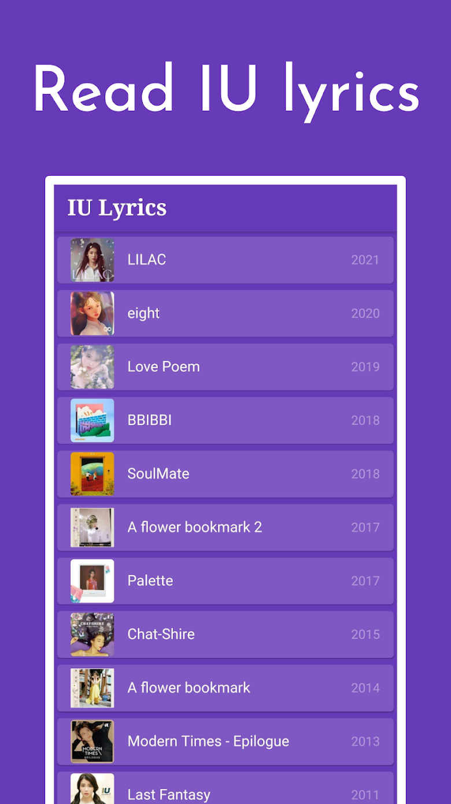

# IU Lyrics 

Lyrics app for [IU's songs](https://en.wikipedia.org/wiki/List_of_songs_written_by_IU).

<a href='https://play.google.com/store/apps/details?id=com.github.airicbear.iu_lyrics&pcampaignid=pcampaignidMKT-Other-global-all-co-prtnr-py-PartBadge-Mar2515-1'></a>

## Screenshots

[](./assets/screenshots/screenshot-1.png)
[](./assets/screenshots/screenshot-2.png)

## Credits

These are some of the websites I use to find the lyrics:

- [AZLyrics](https://www.azlyrics.com/i/iu.html)
- [ColorCodedLyrics](https://colorcodedlyrics.com/2018/02/iu-aiyu-lyrics-index)
- [Genius](https://genius.com/artists/Iu)
- [YouTube](https://www.youtube.com/results?search_query=iu+lyrics)
- [Google Translate](https://translate.google.com/)

## How I add album cover art

1. Look for the album cover art online and download it.

2. Use [ImageMagick](https://imagemagick.org/index.php) to convert the image to 128x128. E.g., `magick convert eight.jpg -resize 128x128 eight_128.jpg`.

3. Add the new `eight_128.jpg` to the `assets/cover_art` folder.

## How I add lyrics

This is generally the process I use for adding lyrics.
However on some websites the text is not as nicely formatted in which case I need to edit it manually.

1. Open the `assets/iu.json` file.

2. Create a new album above the most recent one by following this specific format, e.g.

    ``` json
    {
        "album": "eight",
        "date": "2020-05-06",
        "coverArt": "assets/cover_art/eight_128.jpg",
        "songs": [
            {
                "title": "eight",
                "lyrics": {
                    "han": [],
                    "rom": [],
                    "eng": []
                }
            }
        ]
    },
    ```

3. Find the lyrics online. Refer to the [Lyrics Resources](#Lyrics-Resources) section.

4. Copy the Korean (Hangul) lyrics into a new file buffer in [Visual Studio Code](https://code.visualstudio.com/). (In Visual Studio Code, just click on `File -> New File` or type `Ctrl+N`)

5. Add a new line to the end of the file if there isn't one.

6. On the last line of the lyrics, go to the end of the line and hold down the `Shift` Key and then hit the Right Arrow Key once. This should highlight a single space after the line and then place the cursor on the next line.

7. Hold down `Ctrl+D` until every line is highlighted. This will allow you to edit each line simultaneously.

8. Now, just hit the Left Arrow Key once and add a double-quote and comma, e.g. `",` and then use the `Home` Key to jump to the beginning of the line and add the opening double-quote `"`.

9. Hit the `Esc` Key and delete the last line's comma.

10. Add the formatted Hangul lyrics into the brackets of `"han": []`.

11. Repeat the same procedure for the Roman and English lyrics starting at step 4, adding the corresponding lyrics to `"rom": []` and `"eng": []`.

The lyrics should look something like this (without the `...`) when everything is properly formatted (example lyrics: ["Boo" by IU from Genius](https://genius.com/Iu-boo-lyrics)):

``` json
"Think about it (IU) check it check (IU)",
"Boo boo boo True color present",
"",
"내가 별로라는 외몰 갖고 있는 너라고",
"많이 안 좋아하는 버릇도 모조리 다 갖추고 있어",
"어쩜 스치기만 해도 엄청나게 싫은 얼굴로 (No)",
"널 쳐다봤어 (미안하긴 했어)",
...
"Boo"
```

Each line represents a [`Card`](https://api.flutter.dev/flutter/material/Card-class.html) in Flutter.
The empty line `"",` then represents an empty `Card` which is used to separate each section of the song.

## Environment Setup

1. Install [OpenJDK 8](https://openjdk.java.net/) (`sudo apt install openjdk-8-jdk`)
2. Make sure Java is installed by running `java -version`, if it doesn't work then you may need to add `java` to your `PATH`
4. Install [Flutter](https://flutter.dev/docs/get-started/install) and make sure it's on your `PATH`
6. Run `flutter doctor --android-licenses` and accept all licenses
7. Verify everything is good by running `flutter doctor`
8. Clone the repository via `git clone https://github.com/airicbear/iu-lyrics`

### Android Studio

1. Install [Android Studio](https://developer.android.com/studio/)

2. Install the Flutter plugin for Android Studio.

3. Add Dart SDK to Android Studio from your Flutter installation (e.g. `~/development/flutter/bin/cache/dart-sdk/`)

For more information, [visit the Flutter documentation on setting up Android Studio for Flutter development](https://flutter.dev/docs/get-started/editor?tab=androidstudio).

### Visual Studio Code

1. Install [Visual Studio Code](https://code.visualstudio.com/).

2. Install the [Dart](https://marketplace.visualstudio.com/items?itemName=Dart-Code.dart-code) and [Flutter](https://marketplace.visualstudio.com/items?itemName=Dart-Code.flutter) plug-ins for Visual Studio Code.

For more information, [visit the Flutter documentation on setting up Visual Studio code for Flutter development](https://flutter.dev/docs/development/tools/vs-code).

## Installing

This will build an `app.apk` at `build/app/outputs/release/`:

``` sh
flutter build apk --split-per-abi
```

Then to install the latest build to your device just do:

``` sh
flutter install
```

## Contributing

If you are interested in contributing these lyrics please [submit an issue](https://github.com/airicbear/iu-lyrics/issues) or [create a pull request](https://github.com/airicbear/iu-lyrics/pulls).
